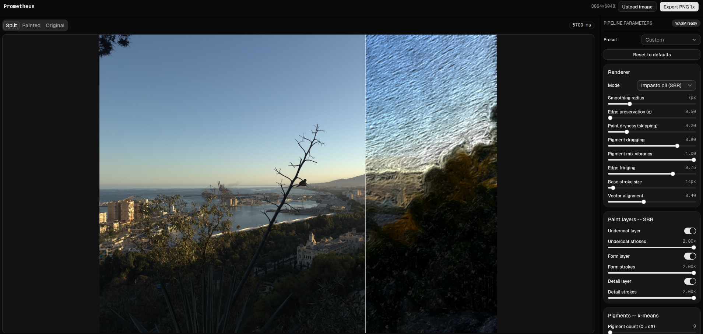

# Prometheus



Upload photo, move few sliders, and watch it become an impasto oil painting with
physically-mixed pigment, viscous palette-knife relief, subsurface-scattered binder,
refractive varnish, drying-stress craquelure, 8-band spectral color under real gallery
illuminants, and centuries of simulated chemical aging - computed entirely in your browser
by freestanding C compiled to WebAssembly. No neural network is consulted. No pixel ever
leaves your machine. No GPU farm burns electricity on your behalf.

---

## Manifesto

This project exists because I was angry.

I saw some posts about selling AI made wallpapers that made uploaded images into oil paintings.
Those *personas* were clicking one button, and charging **\$10 for the JPEG**.

Somewhere else an "app" charges **€10/month - forever** - for "AI oil painting portraits,"
and underneath the landing page there is nothing but a file-upload form, a single HTTP call
to a model someone else trained on paintings **scraped from artists who were never asked,
never credited, and never paid**, and a paywall bolted in front of it. Subscription tiers.
Watermarks on the "free" version. "Credits." For *this*.

I reject the **black-boxification of art**. I reject the lazy, cloud-hosted AI wrappers
whose entire product is somebody else's API key. And I reject the aesthetic they produce:
that dull, grayish **digital mud** - the smeared, desaturated sludge you get when a network
hallucinates a "painting," or when a naive filter blends colors by averaging RGB channels
and turns every confident brushstroke into a muddy brown compromise. Linear RGB blending is
a lie about how paint works. Neural inference is a lie about who made the art.

**My fundamental thesis:** pure, deterministic physics and low-level mathematics, running
locally on the user's own browser via **freestanding WebAssembly**, can achieve stunning
physical rendering with **zero server footprint, zero data harvesting, and absolute user
control.** Every stroke is reproducible. Every color is derived from a citable optical
model. The same image and the same sliders always produce exactly the same painting, bit
for bit, on your hardware, offline, forever. There is no model file. There is no inference.
There is no telemetry. The whole engine is a few kilobytes of C you can read, audit, learn
from, and steal.

Mathematics was free and will remain that way.

### UI Confession

Let's be completely honest: My frontend UI/UX skills are virtually non-existent. That is why
this application relies **100% on [shadcn/ui](https://ui.shadcn.com/).** I didn't write custom
CSS or invent layout hacks - I took shadcn's brilliant, clean primitives, bolted them onto
the WebAssembly engine, and got out of the way. It is fast, functional, and clean **because
of shadcn, not me.** Credit where it is due: the physics is mine, the polish is theirs.

---

## Core Rendering Engine Specifications

Every visual effect below is a deterministic, physics- or optics-based algorithm running on
*your* CPU inside a Web Worker. No preset filters. No inference. These are the exact
pipeline stages implemented in the engine today.

### Laminar Flow Fields (Structure Tensor)

Painter drags the brush *along* form, never across it. I recover that flow analytically.
From the image gradients $g_x, g_y$ (Sobel) I assemble the **structure tensor**, the outer
product of the gradient smoothed by a Gaussian $G_\sigma$:

$$
J = G_\sigma * \begin{bmatrix} g_x^2 & g_x g_y \\ g_x g_y & g_y^2 \end{bmatrix}
$$

The blur is what makes the field *laminar* - it averages away pixel noise and leaves a
smooth, coherent orientation field. The **minor eigenvector** of this symmetric $2\times2$
matrix (solved in closed form, no `atan2`) points along the direction of least change -
i.e. along edges and contours - while the eigenvalue spread

$$
A = \frac{\lambda_1 - \lambda_2}{\lambda_1 + \lambda_2}
$$

gives an **anisotropy** measure that is ~1 along strong structure and ~0 in flat regions.
This single vector field guides every stroke in the engine, so brushwork naturally follows
anatomy and geometry - hair flows with the head, horizon runs flat, iris orbits the
pupil - instead of marching in a dumb uniform direction.

### Dynamic Stroke-Based Rendering (SBR) & Palette Knife

Old flat **LIC filter has been retired and deprecated.** It smeared pixels; it never
*painted*. In its place is a true stroke-based renderer (Haeberli 1990, Hertzmann 1998)
that rebuilds the image from discrete, overlapping smears of pigment, traced as paths along
the flow field over **three multiscale layers**:

- **Undercoat** - coarse, broad slabs that block in the massing and the value structure,
  the way an oil painter lays a dead-colour underpainting.
- **Form** - mid-scale strokes that establish planes and transitions.
- **Detail** - fine strokes that fire *only where the canvas still disagrees with the
  target* (mean-luma error integrated over the stroke footprint). Faces regain detail;
  skies stay broad. That is the decision a painter makes with their eyes, expressed as an
  error integral.

**Dynamic Stroke Width.** Real brush is not a constant-width rubber stamp. Width varies
along the path from two independent physical effects:

- **Curvature pressure** - in sharp turn the artist bears down and the bristles splay, so
  local width scales up with path curvature $\kappa$.
- **Natural taper** - each stroke is thin on the **landing** ($u \approx 0$) as the brush
  touches down, swells through the body, and thins again at **lift-off** ($u \approx 1$)
  as it leaves the canvas, where $u \in [0,1]$ is normalized arc length along the stroke.

### Subtractive Pigment Mixing (Kubelka–Munk Model)

This is how I **completely eradicated the digital gray mud.** Naive editors blend two
colors by averaging their RGB channels - but that is additive-light math applied to
*paint*, and it is physically wrong. Average blue and yellow in RGB and you get a dead,
dirty gray. Real pigment is **subtractive**: each layer absorbs and scatters light, and
mixing blue and yellow yields a deep, vibrant **green**.

I implement the physical **Kubelka-Munk** two-constant model. Every color is converted
from its reflectance $R$ into its **absorption-to-scattering ratio** $K/S$:

$$
\frac{K}{S} = \frac{(1-R)^2}{2R}
$$

Pigments are then mixed **linearly by concentration** in $K/S$ space - the domain where
paint actually superposes - and the blend is inverted back to reflectance:

$$
R = 1 + \frac{K}{S} - \sqrt{\left(\frac{K}{S}\right)^2 + 2\,\frac{K}{S}}
$$

Payoff is organic, optically-correct paint: mixtures stay saturated, complements
deepen instead of graying out, and greens glow the way they do on a real palette.

### Dry-Brush Skipping & Topography Interaction

Dry brush dragged over textured canvas only touches the **peaks** of the weave; the
valleys stay bare. I simulate this literally. As a stroke advances it samples the local
relief height against **blurred baseline elevation (`hbase`)** - the low-frequency lay of
the paint already down - plus the procedural **canvas tooth**. Where the surface sits below
that baseline, deposition is cut off: the paint **skips** over the valleys and lands only on
the raised tooth. At high **dryness** settings this produces the characteristic broken,
scumbled, grainy drag of a starved brush; at low dryness the stroke floods and fills.

### Viscous Paint Displacement (Squeezed Knife Profile)

Palette knife does not lay a flat ribbon of paint - the steel blade **presses the pigment
outward.** My knife cross-section is modeled on that physical squeeze: the **center
hollows** where the blade bears down, and the displaced paint piles into **twin raised beads
peaking near the lateral margins** at normalized cross-stroke coordinate $vn \approx 0.85$.
Layered with **hash-driven dynamic blade tilting** - the blade's attack angle jittered
per-stroke by an integer hash - every smear writes a distinct, asymmetric slab of relief
into the height field, so light later rakes across genuine tool marks rather than a uniform
bump.

### Wet-on-Wet Smudging & Brush Contamination

Paint is wet, and a brush is a **finite reservoir**. Both the SBR brush and the palette
knife **drag upstream canvas color** into the stroke: as the tool moves it picks up whatever
pigment it crosses, contaminating its virtual load, so the color it deposits drifts toward
the colors it has already smeared through - real wet-on-wet blending, not a decal.

Simultaneously the brush's **original charge depletes geometrically** along the stroke. The
deposit opacity of the loaded pigment falls off with normalized stroke progress:

$$
\text{deposit opacity} = 0.55 + 0.45 \cdot e^{-2\,\cdot\,\text{progress}}
$$

so a stroke lays down thick, opaque pigment where it lands and fades toward the underlying
wet paint as it runs out - the exact signature of a brush unloading across the canvas.

### Edge Fringing (Pigment Accumulation)

When paint is pushed by a brush, solid particles pile up at the **edges** of the stroke,
inside the anti-aliased margin. I reproduce this optically at the stroke boundary, over the
cross-stroke band $vn \in [0.72, 0.93]$, with a localized, non-linear adjustment driven by a
fringe factor $fr$:

$$
L \rightarrow L \cdot (1 - 0.28\,fr), \qquad C \rightarrow C \cdot (1 + 0.35\,fr)
$$

Luminance is attenuated and chroma is boosted just inside the margin, so stroke edges gain a
darker, richer, more saturated rim exactly where a real oil edge accumulates pigment -
giving every smear a physical, hand-laid border.

### Anisotropic Specular Varnish Shading

Standard circular Blinn–Phong highlights make paint look like plastic. Varnish over
brushwork does not glint in dots - it glints in **streaks**, stretched perpendicular to the
bristle grooves. So I light the varnish coat with an anisotropic **Kajiya–Kay**
strand-reflection model. Given the local groove tangent $T$ and the half-vector $H$, the
specular term uses the *sine* of their angle rather than the surface normal:

$$
I_{spec} \propto \sin(T, H)^{n} = \left(1 - (T \cdot H)^2\right)^{n/2}
$$

Because the response depends only on the component of $H$ perpendicular to the groove
direction, the highlight collapses into an **elongated glint running strictly across the
brush grooves.** Rotate the light source and watch the specular streaks sweep along the
bristle direction like real varnish catching a raking studio light - anisotropic, physical,
and alive.

### Subsurface Scattering in the Binder (BSSRDF Dipole)

Linseed oil is not opaque - light enters the paint film, scatters inside the translucent
binder, and re-emerges some distance away. The engine redistributes diffuse irradiance with
**Jensen's dipole approximation** of the BSSRDF: a real source at depth $z_r$ below the
surface and a mirrored virtual source at $z_v$ above it,

$$
R_d(r) = \frac{\alpha'}{4\pi}\left[ z_r\,(1+\sigma_{tr} d_r)\,\frac{e^{-\sigma_{tr} d_r}}{d_r^3}
       + z_v\,(1+\sigma_{tr} d_v)\,\frac{e^{-\sigma_{tr} d_v}}{d_v^3} \right]
$$

with $\alpha'$, $\sigma_{tr}$ derived from the user's reduced scattering and absorption
coefficients and the internal Fresnel reflectance of the oil (IOR 1.48). Thin,
high-gradient stroke edges additionally gain a warm **transmission glow** - light bleeding
through the paint rim, attenuated by the local film thickness. When spectral rendering is
active, the dipole constants become **per-wavelength-band quantities** (blue is absorbed and
scattered more strongly inside the binder than red).

### Two-Layer Refractive Varnish

The varnish coat is a genuine second optical layer, not a screen-space gloss overlay. It
carries its own brush-stroke micro-relief, and at every pixel the **Schlick-Fresnel** share
of the incident light glints off that smooth outer surface as a sharp isotropic lobe, while
the transmitted share is **bent by Snell's law** - refracted light and view vectors shade
the paint grooves underneath, attenuated once more on exit. A **gloss map** derived from
pigment density and film thickness modulates the paint-layer lobe: thick, pigment-dense
passages dry matte, thin oil-rich glazes dry glossy - exactly how a real film cures.

### Stress-Fracture Craquelure (Griffith Propagation)

Old paint cracks because the drying film shrinks against a rigid ground. The engine stores
tensile stress $\sigma \sim E \cdot \nabla^2 h$ weighted by film thickness, nucleates crack
tips where the normalized stress clears a tension-controlled threshold, and propagates each
tip **perpendicular to the maximum tensile stress direction** (the dominant eigenvector of
the local height Hessian), advancing while Griffith's energy release rate
$G \sim \sigma^2 a$ exceeds the fracture energy. Tips kink with deterministic jitter,
bifurcate into T-junctions under high stress, and arrest against existing fissures so the
network knits. Every step carves a narrow Gaussian **V-groove** out of the height field;
the shader then traps light inside the fissures and, with age, settles dirt into them.

### Elastic Canvas Stretch (Navier-Cauchy)

A canvas stretched over a wooden frame is pinned at discrete tacks; between them the cloth
sags inward, and the folded corners wrinkle under the diagonal pull. The displacement field
over the boundary band solves the 2D **Navier-Cauchy elastostatic equation**

$$
(1-\nu)\,\nabla^2 u + (1+\nu)\,\nabla(\nabla \cdot u) = 0
$$

with Dirichlet tack-scallop and corner-ripple conditions, relaxed by Gauss-Seidel on a
coarse grid and applied as an inverse bilinear warp - confined to the outer ~4% of the
picture, exactly where a real stretcher deforms the cloth, with wrap-around shading where
the fabric rolls over the bar.

### Spectral Rendering & Metamerism (8-Band Engine)

Three display channels cannot express how a pigment behaves when the light changes: two
paints that match under daylight drift apart under incandescent light because their
underlying reflectance **spectra** differ. That is metamerism, and RGB is blind to it. The
engine therefore carries a continuous spectral power distribution discretized into **8
wavelength bands over 380-730 nm**:

- **Upsampling** - sRGB reflectance is lifted to a spectrum via **Smits' seven basis
  spectra** (white/cyan/magenta/yellow/red/green/blue), resampled onto the band centers.
- **Spectral Kubelka-Munk** - when the spectral engine is on, every wet-on-wet paint mix
  runs the $K/S$ blend independently in all 8 bands, applied as a bias-cancelled correction
  over the exact linear mix so repeated mixing cannot drift. Real yellow + blue makes
  green in the spectrum, not in a lookup table.
- **Physical illuminants** - the reflected spectrum is multiplied by the SPD of the gallery
  light source: tabulated **CIE D65**, **CIE A** and **candle light** evaluated
  analytically from **Planck's law** (2856 K / 1900 K), and a band-averaged **CIE F11**
  tri-band fluorescent constrained to the exact F11 white point.
- **Downsampling** - the spectral radiance is integrated against the **CIE 1931 2°
  color matching functions** (Wyman-Sloan-Shirley analytic fits) back to XYZ and sRGB.

A $3\times3$ anchoring matrix - the inverse of the D65 round trip of the sRGB primaries -
keeps the daylight path colorimetrically neutral, so what remains under any other
illuminant is precisely the physical, unadapted **metameric shift**: under candle light
even the specular glints turn amber, because the first-surface lobe reflects the
illuminant's own spectrum.

### Multi-Pass Glazing (Velatura Layer Stack)

Old-master color is built from **layers**: an opaque underpainting filtered by thin,
heavily diluted glazes. Each glaze pass is solved analytically per wavelength band with the
**finite-thickness Kubelka-Munk two-flux solution**

$$
a = \frac{S+K}{S}, \quad b = \sqrt{a^2-1}, \qquad
R = \frac{\sinh(bSd)}{a\sinh(bSd) + b\cosh(bSd)}, \quad
T = \frac{b}{a\sinh(bSd) + b\cosh(bSd)}
$$

which in the dilute, scatter-free limit degenerates **exactly to the Beer-Lambert law**
$T = e^{-Kd}$ - the pure velatura filter. Films are composed over the base with Kubelka's
layering relation $R_{stack} = R_1 + T_1^2 R_{below} / (1 - R_1 R_{below})$ (the geometric
series of all internal bounce orders), and the air boundary applies the **Saunderson
correction** from the glaze medium's refractive index. Film depth follows the local relief -
paint pools thick in the stroke valleys - and every additional pass deepens saturation the
way a painter builds tone by repeated glazing.

### Chemical Aging: Linseed Yellowing & Metal-Soap Efflorescence

Oil paintings do not just crack - the binder itself degrades chemically over centuries.

- **Linseed yellowing.** The oxidative degradation products of linseed oil (conjugated
  polyene chromophores) absorb in the blue-violet: the aged binder becomes a long-pass
  filter whose absorption coefficient rises steeply below ~470 nm. The engine applies a
  per-band absorption profile peaking in the **400-460 nm bands**, double-pass
  Beer-Lambert (light crosses the film twice), saturating **non-linearly with artwork
  age** and weighted by local film thickness and metal-heavy pigment content - titanium
  and lead whites yellow first, exactly as conservators observe.
- **Metal-soap efflorescence.** Lead and zinc ions migrate through the aged binder and
  saponify with the oil's free fatty acids; the resulting soaps crystallize as white,
  semi-translucent crusts in the **valleys between brush strokes and inside open cracks**.
  The engine grows deterministic crystal colonies there, writes them directly into the 3D
  height field as high-frequency micro-relief, pushes the local surface roughness above
  90% (collapsing both the paint and varnish specular lobes into a weathered matte), and
  mixes the salt bloom over the aged film stack per spectral band.

The **Louvre Archive** preset switches the entire physical stack on at once - craquelure,
BSSRDF, canvas warp, incandescent metamerism, two-pass glazing, and chemical aging - and
produces a centuries-old museum piece from a phone snapshot.

---

## Performance and Architecture

Entire engine is **freestanding C99** - no libc, no emscripten, no runtime of any kind.
It is compiled directly with `clang` and linked with `wasm-ld` down to a single
**~72 KB WASM binary** (`73,926` bytes, exactly) with no imports beyond a linear memory.
That is the whole "backend": a payload smaller than a single icon on most SaaS landing
pages, doing all of the work above - including the full 8-band spectral pipeline.

- **Deterministic bump allocator.** There is no `malloc`, no garbage collector, no heap
  fragmentation. The engine owns one linear-memory arena and hands out scratch buffers with
  a monotonic bump pointer that resets per frame. Allocation is a pointer add; freeing is
  free. This is what makes every render bit-for-bit reproducible.
- **Hardware-native math.** All the transcendental work - the exponential falloffs, the
  sine grooves, the square roots in the Kubelka–Munk inversion and the eigensolve - runs
  through compact polynomial approximations emitted straight to WebAssembly float
  instructions. No math library is linked; the numerics are in the repository, in
  `mathf.c`, for you to read.
- **No hidden dependencies.** No WASI, no JS shims doing real work, no network. The C
  sources in `engine/` (`pipeline.c`, `tensor.c`, `flow.c`, `sbr.c`, `knife.c`,
  `impasto.c`, `color.c`, `kuwahara.c`, `quantize.c`, `lanczos.c`, `field.c`, `memory.c`,
  `mathf.c`) are the complete engine.

---

## Build and Deploy

```sh
npm install
npm run build:wasm   # requires clang + wasm-ld (package 'lld' on Fedora)
npm run dev
```

Compiled `public/wasm/prometheus.wasm` artifact **is committed to the repository.**
This means developers do **not** need a C toolchain to run the frontend locally or to deploy
it - `npm install && npm run dev` works out of the box.

You only need `clang` + `wasm-ld` if you intend to modify the C sources in `engine/` and rebuild
the binary yourself.

### Deploying (Vercel, or anywhere static)

The repository is deploy-ready: `vercel.json` configures the build command, output directory
and cache headers. Because the WASM artifact is committed, **the deploy machine needs no C
toolchain** - Vercel just runs `npm run build` and ships static files.

```sh
npx vercel        # from the repo root; that is the whole procedure
```

Any other static host (Netlify, GitHub Pages, nginx box, USB stick) works the same way:
`npm run build`, then serve `dist/`. There is no server-side component whatsoever - the
"backend" is your visitors' own CPUs. A hosted instance is a convenience, not a leash: no
accounts, no quotas, no telemetry, nothing to upsell. If it ever disappears, nothing is
lost; every visitor already had the entire engine in their browser cache.

### License

**GPL-2.0, copyleft** (see [LICENSE](LICENSE)). No accounts, no watermarks, no "3 free
credits." Take it, ship it, learn from it - but keep it open. If someone tries to sell you
this exact software, the license is on your side: demand the source, take it, and run. Free
means free, downstream and forever. That's the point.
